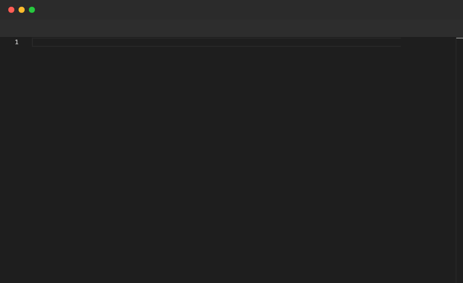

# Annotate

Displays a text overlay on the video frame. Use it to narrate what is happening on screen. Valid at the top level and inside `File` blocks.

## Syntax

```
Annotate "your message here"
```

## Example

```pop
Annotate "Annotate displays a text overlay on the video frame"

Sleep 2s

File "greet.ts" {
  Type "function greet(name: string): string {"
  Enter
  Type "return `Hello, ${name}!`;"
  Enter
  Backspace 1
  Type "}"
  Sleep 1s
  Annotate "This function greets a user by name"
  Sleep 2s
}
```

## Demo



---

[← Back to Examples](../README.md)
