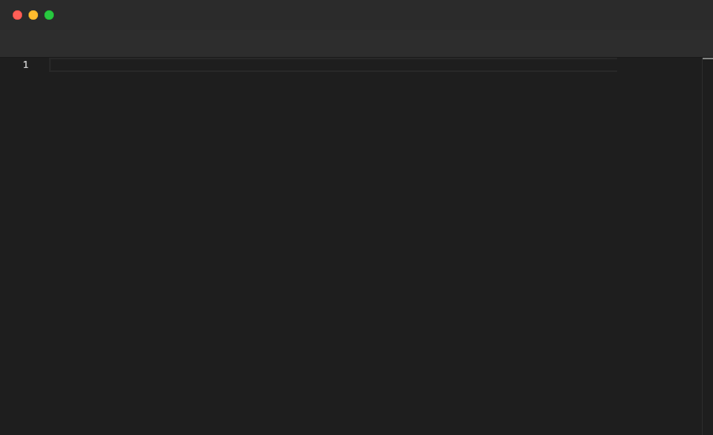

# Backspace

Presses the Backspace key the specified number of times. Commonly used to remove auto-indentation added by Monaco before typing a closing brace, or to delete characters at the cursor position. Only valid inside `File` blocks.

## Syntax

```
Backspace <count>
```

## Example

```pop
File "config.ts" {
  Type "interface Config {"
  Enter
  Type "width: number;"
  Enter
  Type "height: number;"
  Enter
  Annotate "Backspace 1 removes the auto-indent before the closing brace"
  Sleep 1s
  Backspace 1
  Type "}"
  Sleep 2s
}
```

## Demo



---

[← Back to Examples](../README.md)
