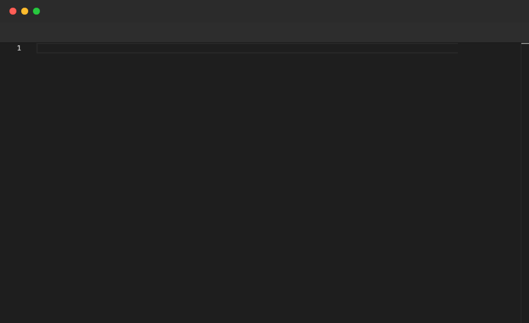

# Enter

Presses the Enter key. Monaco will auto-indent the next line based on the current context, so you rarely need to add `Tab` commands after `Enter` inside blocks. Only valid inside `File` blocks.

## Syntax

```
Enter
```

## Example

```pop
File "person.ts" {
  Type "interface Person {"
  Enter
  Type "name: string;"
  Enter
  Type "age: number;"
  Enter
  Type "email: string;"
  Enter
  Backspace 1
  Type "}"
  Sleep 2s
}
```

## Demo



---

[← Back to Examples](../README.md)
