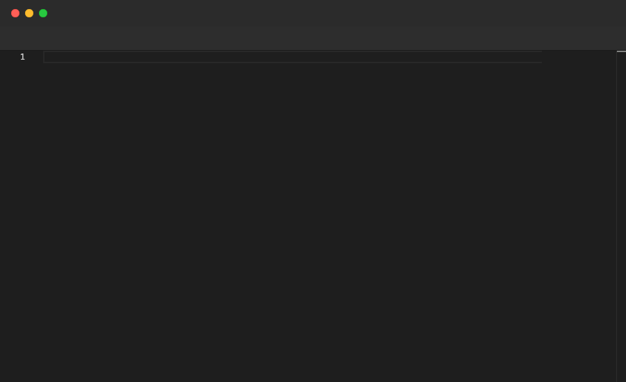

# File

Opens a named tab in the editor and runs the commands inside it. If the file is already open, it switches focus to that tab. Commands inside a `File` block operate on that file's content.

## Syntax

```
File "filename" {
  ...commands...
}
```

## Example

```pop
File "hello.ts" {
  Type "const message = 'Hello, World!';"
  Enter
  Type "console.log(message);"
  Sleep 2s
}

Annotate "Switching to a second file tab"

Sleep 1s

File "goodbye.ts" {
  Type "const farewell = 'Goodbye, World!';"
  Enter
  Type "console.log(farewell);"
  Sleep 2s
}
```

## Demo



---

[← Back to Examples](../README.md)
