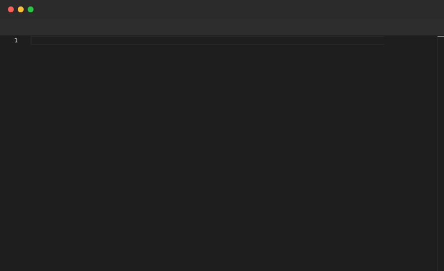

# Focus

Switches the active editor panel to the one that has the given file open. Most useful after a `Split` to control which panel receives subsequent commands. Valid at the top level.

## Syntax

```
Focus "filename"
```

## Example

```pop
File "a.ts" {
  Type "// Module A"
  Enter
  Type "export const A = 1;"
  Sleep 1s
}

Split Right

File "b.ts" {
  Type "// Module B"
  Enter
  Type "export const B = 2;"
  Sleep 1s
}

Annotate "Focus switches the active panel to the given file"

Sleep 1s

Focus "a.ts"

Sleep 1s

Annotate "Now focused on a.ts"

Sleep 2s

Focus "b.ts"

Sleep 1s

Annotate "Now focused on b.ts"

Sleep 2s
```

## Demo



---

[← Back to Examples](../README.md)
