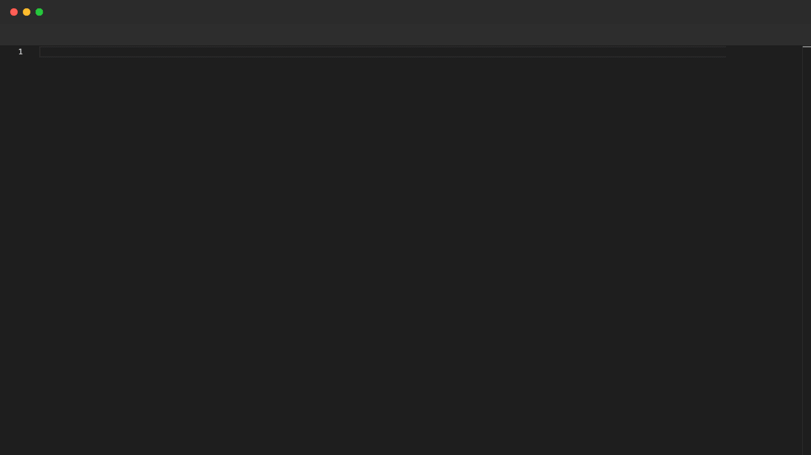

# Full Demo

A complete scene showcasing what popcorn can do — scripted annotations, typing animations, paste, highlights, split view, and focus, all in one recording.

**Story**: refactoring a legacy `UserService` god-class into clean, typed TypeScript modules.

## Demo



## What's demonstrated

| Command | Used for |
|---|---|
| `Annotate` | Narrating each step with emoji overlays |
| `Paste` | Dropping the legacy code instantly |
| `Highlight` | Pointing out the problem areas |
| `Type` | Animating the refactored code being written |
| `Split Right` | Opening a second panel for the new service |
| `Focus` | Switching between the before/after files |
| `Unsplit` | Returning to a single panel for the outro |
| `Sleep` | Giving the viewer time to read each annotation |

## Scene structure

```
scene.pop
├── Scene 1 — paste the legacy UserService and highlight its problems
├── Scene 2 — type the pure User types (user.types.ts)
├── Scene 3 — paste the clean validator (user.validator.ts)
├── Scene 4 — type the new service side-by-side (Split Right)
└── Scene 5 — compare before/after with Focus, then Unsplit
```

## Editor setup

```pop
Editor {
  "language": "typescript",
  "theme": "vs-dark",
  "fontSize": 16,
  "fontFamily": "JetBrains Mono",
  "minimap": { "enabled": false },
  "lineNumbers": "off",
  "roundedSelection": false,
  "scrollBeyondLastLine": false
}
```

## Render it yourself

```bash
popcorn render examples/full-demo/scene.pop -o demo.gif -f gif
```

---

[← Back to Examples](../README.md)
