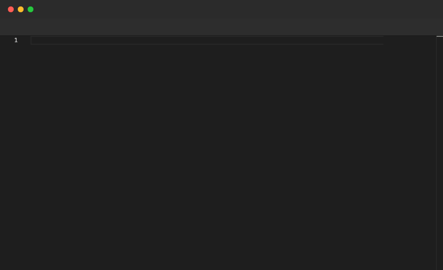

# Highlight

Highlights a single line or a range of lines in the editor. Useful for drawing the viewer's attention to a specific section, often paired with `Annotate`. Only valid inside `File` blocks.

## Syntax

```
# Single line
Highlight <line>

# Range (line:col to line:col)
Highlight <line>:<col>-<line>:<col>
```

## Example

```pop
File "math.ts" {
  Paste """
export function add(a: number, b: number): number {
  return a + b;
}

export function multiply(a: number, b: number): number {
  return a * b;
}
"""
  Sleep 1s
  Annotate "Highlight a single line"
  Sleep 1s
  Highlight 1
  Sleep 2s
  Annotate "Highlight a range (line:col-line:col)"
  Sleep 1s
  Highlight 5:1-7:1
  Sleep 2s
}
```

## Demo



---

[← Back to Examples](../README.md)
