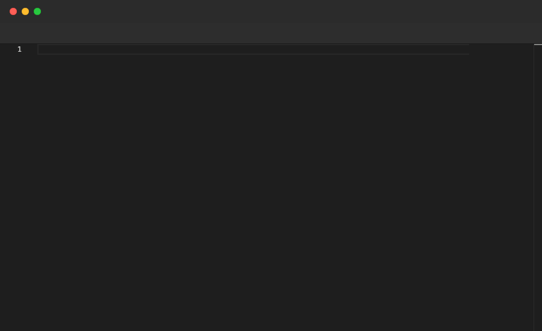

# ImportScene

Imports another `.pop` file and expands it inline at the point of the directive. Use it to split a long recording into smaller, reusable scene files that are composed in a main entry point. Circular imports are detected and reported as errors.

## Syntax

```
ImportScene "path/to/scene.pop"
```

## Example

**`scene.pop`** — the main entry point:
```pop
Config {
  TypingMode Machine
  TypingSpeed 500
  Width 900
  Height 550
  Fps 15
}

Editor {
  "language": "typescript",
  "theme": "vs-dark",
  "fontSize": 14,
  "fontFamily": "JetBrains Mono",
  "minimap": { "enabled": false },
  "lineNumbers": "on"
}

ImportScene "part1.pop"
ImportScene "part2.pop"
```

**`part1.pop`**:
```pop
Annotate "Scene 1: Define the interface"

Sleep 1s

File "user.ts" {
  Type "interface User {"
  Enter
  Type "id: number;"
  Enter
  Type "name: string;"
  Enter
  Backspace 1
  Type "}"
  Sleep 2s
}
```

**`part2.pop`**:
```pop
Annotate "Scene 2: Implement the factory function"

Sleep 1s

File "user.ts" {
  Enter
  Enter
  Type "function createUser(id: number, name: string): User {"
  Enter
  Type "return { id, name };"
  Enter
  Backspace 1
  Type "}"
  Sleep 2s
}
```

## Demo



---

[← Back to Examples](../README.md)
