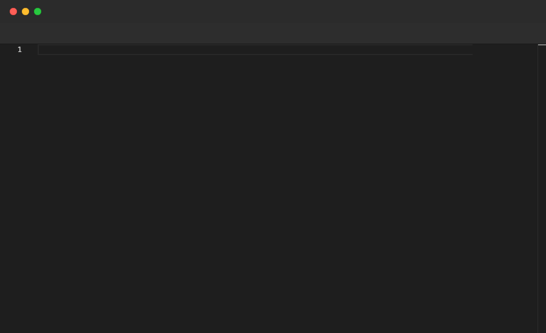

# MoveTo

Moves the cursor to the specified line number. Use it to navigate to a location before performing further edits. Only valid inside `File` blocks.

## Syntax

```
MoveTo <line>
```

## Example

```pop
File "functions.ts" {
  Paste """
function add(a: number, b: number): number {
  return a + b;
}

function subtract(a: number, b: number): number {
  return a - b;
}

function multiply(a: number, b: number): number {
  return a * b;
}
"""
  Sleep 1s
  Annotate "MoveTo moves the cursor to a specific line"
  Sleep 1s
  MoveTo 5
  Sleep 1s
  Annotate "Cursor is now at line 5"
  Sleep 2s
  MoveTo 9
  Sleep 1s
  Annotate "Cursor is now at line 9"
  Sleep 2s
}
```

## Demo



---

[← Back to Examples](../README.md)
