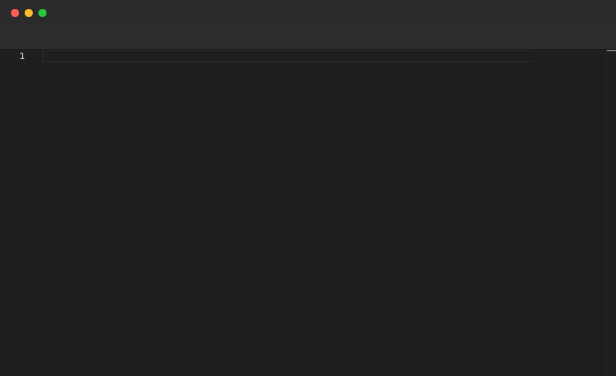

# Scroll

Scrolls the editor to bring the specified line number into view. Use it after populating a long file to navigate to a particular section. Only valid inside `File` blocks.

## Syntax

```
Scroll <line>
```

## Example

```pop
File "constants.ts" {
  Paste """
export const A = 1;
export const B = 2;
...
export const T = 20;
"""
  Sleep 1s
  Annotate "Scroll brings a specific line into view"
  Sleep 1s
  Scroll 15
  Sleep 1s
  Annotate "Scrolled to line 15"
  Sleep 2s
  Scroll 1
  Sleep 1s
  Annotate "Back to the top"
  Sleep 2s
}
```

## Demo



---

[← Back to Examples](../README.md)
