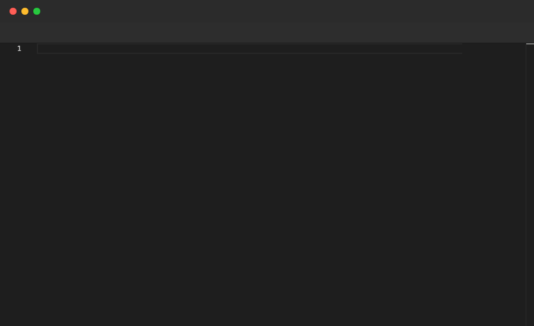

# Select

Selects a range of text in the editor using `line:col` coordinates for both the start and end positions. Only valid inside `File` blocks.

## Syntax

```
Select <line>:<col>-<line>:<col>
```

## Example

```pop
File "greetings.ts" {
  Paste """
const greeting = "Hello, World!";
const farewell = "Goodbye, World!";
console.log(greeting);
console.log(farewell);
"""
  Sleep 1s
  Annotate "Select selects a range of text (line:col-line:col)"
  Sleep 1s
  Select 1:7-1:15
  Sleep 1s
  Annotate "Selected 'greeting' on line 1"
  Sleep 2s
  Select 2:7-2:15
  Sleep 1s
  Annotate "Selected 'farewell' on line 2"
  Sleep 2s
}
```

## Demo



---

[← Back to Examples](../README.md)
