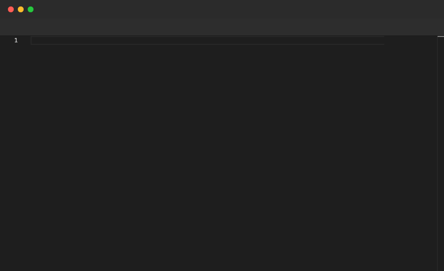

# Sleep

Pauses the scene for a given duration. Use it to let the viewer read an annotation, absorb a code change, or create natural pacing between steps. Accepts seconds (`s`) or milliseconds (`ms`). Valid at the top level and inside `File` blocks.

## Syntax

```
Sleep <value>s
Sleep <value>ms
```

## Example

```pop
Annotate "Sleep pauses the scene for a given duration"

Sleep 2s

File "steps.ts" {
  Annotate "Step 1 — pause 1 second"
  Type "const x = 10;"
  Sleep 1s
  Enter
  Annotate "Step 2 — pause 1500ms"
  Type "const y = x * 2;"
  Sleep 1500ms
  Enter
  Annotate "Step 3 — pause 2 seconds"
  Type "console.log(y);"
  Sleep 2s
}
```

## Demo



---

[← Back to Examples](../README.md)
