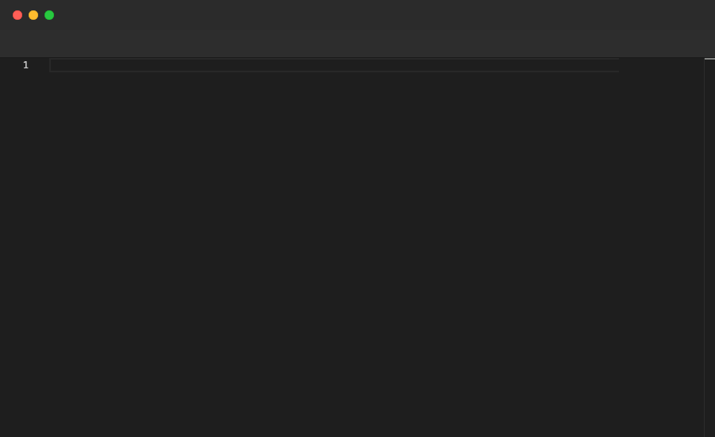

# Split / Unsplit

`Split` opens a second editor panel either to the right or below the current one. `Unsplit` removes the split and returns to a single panel. Both are valid at the top level.

## Syntax

```
Split Right
Split Down

Unsplit
```

## Example

```pop
File "before.ts" {
  Type "class User {"
  Enter
  Type "name: string;"
  Enter
  Backspace 1
  Type "}"
  Sleep 1s
}

Split Right

Annotate "Writing the refactored version side by side"

Sleep 1s

File "after.ts" {
  Type "interface User {"
  Enter
  Type "name: string;"
  Enter
  Backspace 1
  Type "}"
  Sleep 2s
}

Unsplit

Annotate "Unsplit closes the split view"

Sleep 2s
```

## Demo



---

[← Back to Examples](../README.md)
