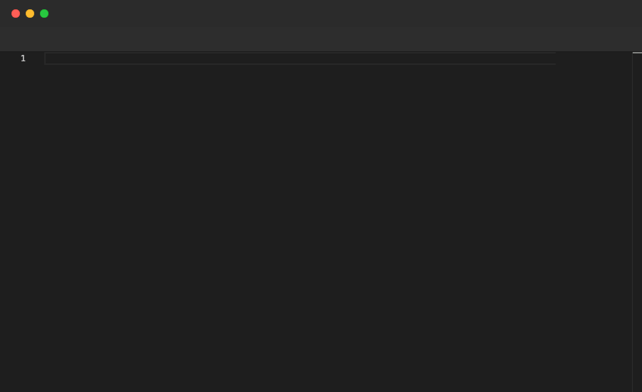

# Tab

Presses the Tab key for manual indentation. Monaco handles most indentation automatically after `Enter`, so `Tab` is typically only needed in contexts where auto-indent does not apply (e.g. inside `switch` case bodies). Only valid inside `File` blocks.

## Syntax

```
Tab
```

## Example

```pop
File "describe.ts" {
  Type "function describe(value: number): string {"
  Enter
  Type "switch (value) {"
  Enter
  Type "case 1:"
  Enter
  Tab
  Type "return 'one';"
  Enter
  Backspace 1
  Type "case 2:"
  Enter
  Tab
  Type "return 'two';"
  Enter
  Backspace 1
  Type "default:"
  Enter
  Tab
  Type "return 'other';"
  Enter
  Backspace 1
  Backspace 1
  Type "}"
  Enter
  Backspace 1
  Type "}"
  Sleep 2s
}
```

## Demo



---

[← Back to Examples](../README.md)
