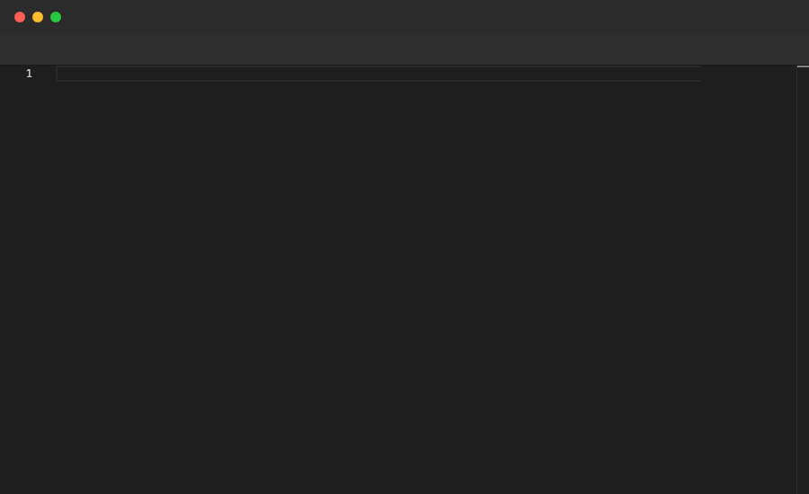

# Themes

Popcorn ships with 54 community themes from [monaco-themes](https://github.com/brijeshb42/monaco-themes), all bundled locally — no CDN required. Set the active theme via the `"theme"` key in the `Editor {}` block.

## Syntax

```
Editor {
  "theme": "<ThemeName>"
}
```

Theme names are derived from the file names in the `monaco-themes` library: spaces are replaced with hyphens and parentheses are removed. For example, `GitHub Light` becomes `GitHub-Light`.

In addition to the community themes, Monaco's four built-in themes are always available: `vs`, `vs-dark`, `hc-black`, and `hc-light`.

## Commands used to generate these examples

```bash
bin/popcorn render examples/themes/dracula.pop     -o examples/themes/dracula.gif     -f gif
bin/popcorn render examples/themes/monokai.pop     -o examples/themes/monokai.gif     -f gif
bin/popcorn render examples/themes/github-light.pop -o examples/themes/github-light.gif -f gif
```

## Dracula


## Monokai


## GitHub Light



---

[← Back to Examples](../README.md)
