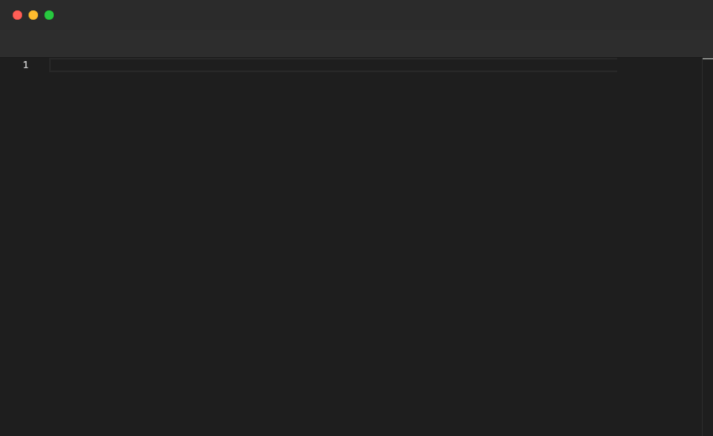

# Type

Types text character by character, simulating a real keystroke stream. The rhythm is controlled by `TypingMode` and `TypingSpeed` in the `Config` block. Supports single-line and triple-quoted multi-line strings. Only valid inside `File` blocks.

## Syntax

```
# Single line
Type "text"

# Multi-line
Type """
line one
line two
"""
```

## Typing modes

| Mode | Behaviour |
|---|---|
| `Human` | Variable delays between keystrokes, mimics natural typing |
| `Machine` | Steady, uniform delay between every keystroke |
| `Burst` | No delay — text appears instantly (same as `Paste`) |

## Example

```pop
Config {
  TypingMode Human
  TypingSpeed 400
  ...
}

File "hello.ts" {
  Type "const message = 'Hello, World!';"
  Enter
  Type "console.log(message);"
  Sleep 1s
  Enter
  Enter
  Annotate "Multi-line Type with triple-quote syntax"
  Sleep 1s
  Type """
function greet(name: string): string {
return `Hello, ${name}!`;
"""
  Backspace 1
  Type "}"
  Sleep 2s
}
```

## Demo



---

[← Back to Examples](../README.md)
